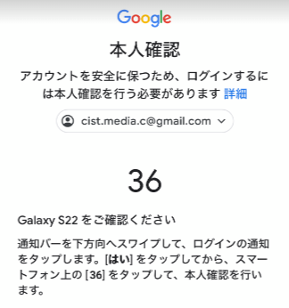
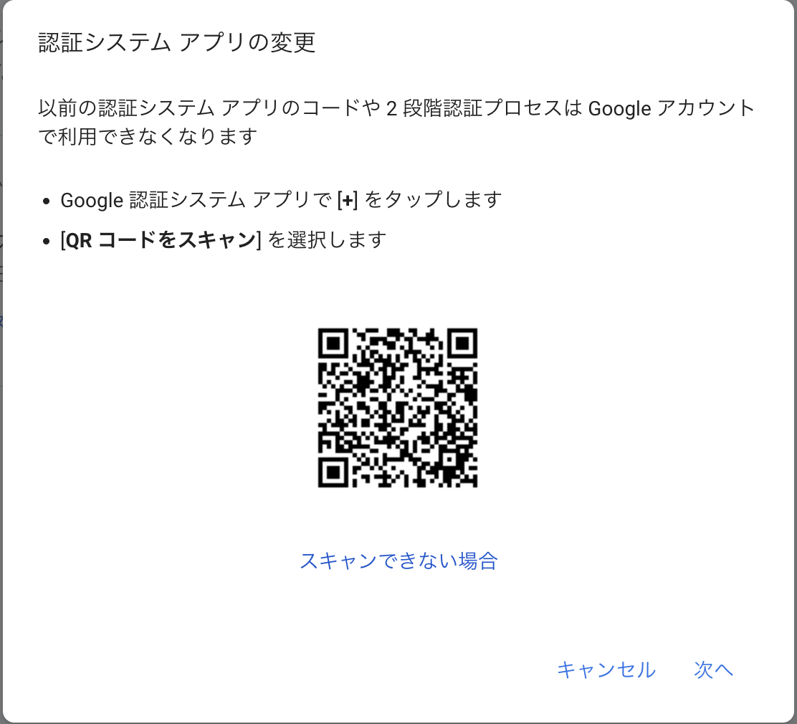

# メディコンのgoogle2段階認証について

2023年12月では新規端末からgoogleアカウントにログインを行おうとすると
 2段階の認証として特定の個人のスマホに通知が行き、そこで承認をしないとログインができない状態にありました.

そのためgoogleの認証コード入力を使用した2段階認証を導入しました。
これから新規端末からログインを行う際には*Google Authenticator*が必要となります。

拡張機能もあるようですが今回はスマホアプリとして話を進めていきます。

Android端末ならplaystore？
iPhoneならappstoreで

Google Authenticator
 
こんなの→

と検索し、インストールをお願いします

で起動して何のアカウントでもいいのでログインを行ってください。(本当になんでもいい)
すると右下にレインボーの＋ボタンがあるので押してQRコードで読み取りを行ってください。
 

すると6桁の数字が出ると思います。これが2段階認証に必要なコードとなります。

この状態で新規端末からログインを行うと数字を入れろと言われるのでこのコードを入力してください。
